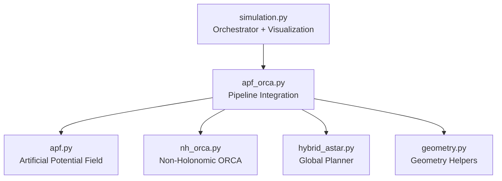

# Swarm Robot Navigation — Complete Codebase Documentation

> **Scope**: Every file, class, method, constant, equation, and design decision across
> [apf.py](file:///home/rupendra/Rupendra/bots_swarm/apf.py),
> [nh_orca.py](file:///home/rupendra/Rupendra/bots_swarm/nh_orca.py),
> [apf_orca.py](file:///home/rupendra/Rupendra/bots_swarm/apf_orca.py),
> [simulation.py](file:///home/rupendra/Rupendra/bots_swarm/simulation.py).

---

## 1. Problem Statement

**What are we solving?**
Multiple differential-drive robots must navigate from start positions to goal positions in a shared 20×20 m workspace containing:
- **Static obstacles** (pillars, walls) — known at planning time
- **Dynamic unknown obstacles** (humans, objects detected by overhead camera) — discovered at runtime
- **Other swarm robots** — cooperative agents with perfect telemetry

**Why is this hard?**
1. Classical path planners (A*) compute once and are blind to runtime obstacles
2. Reactive obstacle avoidance (APF) alone gets trapped in local minima
3. Multi-robot coordination (ORCA) assumes holonomic motion, but real robots are differential-drive (non-holonomic)
4. Unknown obstacles (camera blobs) have no communication protocol — we cannot assume cooperation

**The solution**: A 6-phase pipeline that separates concerns:

```
Phase 1: Hybrid A*        → Global path (static map only)
Phase 2: Waypoint Tracker  → V_path (floating carrot velocity)
Phase 3: APF Shield        → F_unknown (repulsion from camera blobs)
Phase 4: Intention Blender → V_pref = V_path + F_unknown
Phase 5: NH-ORCA           → V_safe (cooperative swarm avoidance)
Phase 6: Motor Mapper      → (v, ω) wheel commands
         Emergency Brake   → Hard geometric safety override
```

**Architectural Firewall**: APF never sees swarm agents. ORCA never sees camera blobs. They communicate only through `V_pref`. This prevents double-counting and keeps each algorithm in its valid domain.

---

## 2. File Architecture



| File | Lines | Purpose |
|------|-------|---------|
| `apf.py` | 713 | APF math: Classical + Improved (GNRO + local minima escape) |
| `nh_orca.py` | 626 | NH-ORCA: velocity obstacles, half-planes, LP solver, kinematic mapper |
| `apf_orca.py` | 1759 | Pipeline glue: WaypointTracker, IntentionBlender, MotorMapper, EmergencyBrake, FleetManager |
| `simulation.py` | 382 | Config, blob dynamics, Euler integration, matplotlib animation |

---

## 3. `apf.py` — Artificial Potential Field

### 3.1 Purpose
Computes repulsive forces that push the robot away from obstacles. Used as "The Shield" in Phase 3 — handles unknown camera blobs that ORCA cannot see.

### 3.2 Class Hierarchy

```
APFBase (ABC)           ← Interface: get_force(), get_repulsive_only()
├── ClassicalAPF        ← Original: k_rep / ρ² repulsion
│   └── APF (alias)     ← Backwards-compatible constructor
└── ImprovedAPF         ← GNRO fix (Eq.1-3) + local minima (Eq.4-6)
```

### 3.3 Geometry Helpers

#### `closest_point_on_circle(robot_pos, (cx, cy, r))` → `np.ndarray`
Returns the point on a circle's surface nearest to the robot. Used to compute `ρ` (surface gap).
```
direction = robot_pos - centre
result = centre + (direction / ||direction||) × radius
```
Edge case: if robot is at circle centre, returns `centre + [r, 0]`.

#### `closest_point_on_rect(robot_pos, (x_min, y_min, x_max, y_max))` → `np.ndarray`
Clamps robot position to the rectangle bounds:
```
cx = clip(robot_x, x_min, x_max)
cy = clip(robot_y, y_min, y_max)
```

### 3.4 Obstacle Data Classes

| Class | Fields | Purpose |
|-------|--------|---------|
| `CircleObstacle` | `cx, cy, radius` | Static circular obstacle (pillar) |
| `RectObstacle` | `bounds = (x_min, y_min, x_max, y_max)` | Static rectangular obstacle (wall) |
| `DynamicObstacle` | `pos[2], radius=0.3, priority=1.0` | Runtime obstacle from camera |

`priority` is a repulsion multiplier: 1.0 = normal, 1.5 = more dangerous (e.g., fast-moving human).

### 3.5 Parameter Dataclasses

#### `ClassicalAPFParams`

| Parameter | Default | Unit | What It Controls |
|-----------|---------|------|------------------|
| `k_att` | 1.0 | — | Attractive force gain toward goal |
| `k_rep` | 2.0 | — | Repulsive force gain from obstacles |
| `rho_0` | 1.5 | m | Influence radius: obstacles beyond this distance produce zero force |
| `max_force` | 5.0 | m/s | Force magnitude clamp (prevents infinite force at ρ→0) |
| `vortex_gain` | 0.4 | — | Tangential force fraction: helps robot slide around obstacles instead of oscillating head-on |
| `robot_radius` | 1.0 | m | Physical robot radius for gap calculation |
| `enable_static_repulsion` | True | — | Toggle static obstacle repulsion on/off |

#### `ImprovedAPFParams` (extends Classical)

| Parameter | Default | Unit | Paper Reference | What It Controls |
|-----------|---------|------|-----------------|------------------|
| `eta` (η) | 12.0→**18.0** | — | Eq.1-2 | GNRO repulsion gain (replaces k_rep in improved formula) |
| `n_reg` (n) | 0.5 | — | Eq.1-2 | Regulation constant (0 < n < 1). Controls how goal-distance modulates repulsion |
| `step_length` (l) | 0.20 | m | Eq.4 | Normal step size for stuck detection |
| `beta_stuck` (β) | 3.0 | — | Eq.4 | Stuck threshold multiplier: step < β×l → "slow" |
| `stuck_window` | 8 | ticks | — | Consecutive slow steps before declaring "stuck" |
| `beta1` (β₁) | 2.0 | m | Eq.5 | Virtual target x-amplitude |
| `beta2` (β₂) | 2.0 | m | Eq.6 | Virtual target y-amplitude |
| `n_vt` | 1.0 | — | Eq.5-6 | Oscillation frequency for virtual target |
| `virtual_target_duration` | 20 | ticks | — | How long to chase virtual target before reverting |

**Current tuned values** (in simulation.py): `eta=18.0, rho_0=4.0, max_force=18.0, vortex_gain=0.4`

### 3.6 Mathematical Models

#### 3.6.1 Classical Repulsion

For each obstacle with surface gap `ρ < ρ₀`:

```
F_rep = k_rep × (1/ρ − 1/ρ₀) / ρ²
```

- As ρ → 0: force → ∞ (clamped by max_force)
- At ρ = ρ₀: force = 0 (influence boundary)
- Tangential component: `F_tangent = F_rep × vortex_gain × perpendicular_dir`

The tangential component creates a rotational push that helps the robot slide around obstacles instead of getting stuck oscillating directly in front of them.

#### 3.6.2 GNRO Improved Repulsion (Eq.1-3)

**Problem with Classical**: repulsion is independent of goal distance. When the robot is far from the goal, strong repulsion deflects it too far. When near the goal, repulsion may be too weak.

**GNRO fix**: scale repulsion by `ρ_g^n` (distance to goal raised to power n):

**Eq.1**: `F_rep1 = η × (1/ρ − 1/ρ₀) × ρ_g^n / ρ²`

**Eq.2**: `F_rep2 = (n/2) × η × (1/ρ − 1/ρ₀)² × ρ_g^(n-1)`

**Eq.3**: `F_total = F_rep1 + F_rep2` (applied in radial direction from obstacle toward robot)

**Effect**:
- Far from goal (ρ_g large) → repulsion STRONGER → robot finds wide path around obstacle
- Near goal (ρ_g small) → repulsion softens → robot can approach goal near obstacles

With `n=0.5`: `ρ_g^0.5 = √ρ_g`. At ρ_g=10m, multiplier=3.16. At ρ_g=0.5m, multiplier=0.71.

#### 3.6.3 Local Minima Escape (Eq.4-6)

**Problem**: when attractive and repulsive forces balance exactly, the robot stops (local minimum). Classical APF has no escape mechanism.

**State machine**: `normal → slow-accumulating → stuck → virtual-target-active → expired → normal`

**Eq.4 (stuck detection)**: `step_length < β × l`
If the robot moves less than `3.0 × 0.20 = 0.60m` for 8 consecutive ticks, it's stuck.

**Eq.5 (virtual target x)**: `x_t = x_b + β₁ × sin(n_vt × (x_g − x))`

**Eq.6 (virtual target y)**: `y_t = y_b + β₂ × sin(n_vt × (y_g − y))`

Where `(x_b, y_b)` is the nearest obstacle position and `(x_g, y_g)` is the goal. The sinusoidal offset creates a virtual waypoint that lures the robot around the obstacle. The robot chases this virtual target for 20 ticks, then reverts to real goal.

### 3.7 Key Methods

#### `APFBase._surface_gap_static(robot_pos, surface_pt, robot_radius)` → float
```
ρ = ||robot_pos − surface_pt|| − robot_radius
return max(ρ, 0.01)  ← floor at 1cm to prevent division by zero
```

#### `APFBase._dynamic_gap(robot_pos, obs, robot_radius)` → (centre_dist, surface_gap, radial_dir)
```
diff = robot_pos − obs.pos
centre_dist = ||diff||
surface_gap = centre_dist − obs.radius − robot_radius  ← can be NEGATIVE (overlap)
radial_dir = diff / centre_dist  ← unit vector: obstacle → robot
```

#### `APFBase._emergency_push(penetration, push_dir, max_force)` → force vector
When robot is INSIDE obstacle (ρ ≤ 0):
```
mag = max_force × (1 + penetration × 2)
F = mag × push_dir + (mag × 0.5) × tangent
```
Doubles the force for every meter of penetration. Tangential component helps escape.

#### `ImprovedAPF.get_repulsive_only(robot_pos, dyn_obs, goal_pos, robot_id)` → force
Main entry point for Phase 3. Steps:
1. Resolve effective goal via `_resolve_goal()` (handles virtual target logic)
2. If goal available → GNRO formula with ρ_g
3. If no goal → classical fallback
4. Clamp to max_force

---

## 4. `nh_orca.py` — Non-Holonomic ORCA

### 4.1 Purpose
Handles cooperative collision avoidance between swarm robots. Only sees robots with perfect telemetry — never sees camera blobs. This is "The Scalpel" (Phase 5).

### 4.2 Why NH-ORCA instead of standard ORCA?
Standard ORCA assumes robots can move in any direction instantly (holonomic). Real differential-drive robots cannot strafe sideways. NH-ORCA adds three corrections:
1. **Inflated radius**: `r_inflated = r + ε` (tracking error budget)
2. **P_AHV polygon**: Set of velocities the robot can actually achieve
3. **Kinematic mapping**: `(vx, vy) → (v, ω)` via paper Eq.8-9

### 4.3 `DiffDriveConfig` — Robot Physical Parameters

| Parameter | Current Value | Unit | What It Represents |
|-----------|--------------|------|-------------------|
| `robot_radius` | 1.0 | m | Physical radius: centre to outermost edge |
| `wheel_base` | 0.8 | m | Distance between left and right wheel contact patches |
| `wheel_radius` | 0.033 | m | Individual wheel radius |
| `max_linear_speed` | 2.0 | m/s | Maximum forward speed |
| `max_angular_speed` | 5.0 | rad/s | Maximum rotation rate |
| `max_wheel_speed` | 3.0 | m/s | Maximum individual wheel surface speed |
| `max_linear_accel` | 2.0 | m/s² | Acceleration limit (smooth starts) |
| `max_linear_decel` | 3.0 | m/s² | Deceleration limit (smooth stops) |
| `max_angular_accel` | 4.0 | rad/s² | Angular acceleration limit (smooth turns) |
| `tracking_error` (ε) | 0.30 | m | Max drift from holonomic path. Smaller = tighter packing, less tolerance |
| `orientation_time` (T) | 0.8 | s | Time budget to rotate to new heading. Must be ≥ sim_dt |
| `time_horizon` (τ) | 3.0 | s | ORCA collision lookahead window |
| `neighbor_dist` | 6.0 | m | Only consider robots within this range |
| `sim_dt` | 0.1 | s | Control period (10 Hz) |
| `social_bubble_factor` | 0.20 | — | 20% extra clearance between swarm robots |

**Derived properties**:
- `inflated_radius = robot_radius + tracking_error = 1.0 + 0.30 = 1.30m`
- `social_radius = robot_radius × (1 + 0.20) + tracking_error = 1.20 + 0.30 = 1.50m`

### 4.4 `NHKinematicMapper` — Holonomic → Differential Drive (Eq.8-9)

Converts safe holonomic velocity `v_H* = (vx, vy)` to physical `(v, ω)`.

#### Three Kinematic Regions

**R_A1 (Normal)**: Small heading error, angular speed within limits.
```
ω = θ_err / T         (rotation to align with target heading)
v = optimal_v(V_H, θ)  (Eq.8)
```

**R_A2 (Tight Turn)**: Heading error requires ω > ω_max.
```
ω = ±ω_max             (clamped at maximum)
v = reduced to keep wheel speeds feasible
```

**R_B (Stop and Spin)**: Error so large that forward motion would exceed tracking error ε.
```
v = 0                   (stop completely)
ω = ±ω_max             (spin in place until aligned)
```

#### Eq.8 — Optimal Forward Speed
```python
v* = V_H × θ × sin(θ) / (2 × (1 − cos(θ)))
```
This minimizes tracking error while maintaining forward progress. At θ=0°: v*=V_H (full speed). At θ=90°: v*≈0.76×V_H. At θ=180°: v*→0.

#### Eq.13 — Maximum Holonomic Speed
```python
V_H_max = (ε / T) × √(2(1−cos θ) / (2(1−cos θ) − sin²θ))
```
Used to build the P_AHV polygon (set of achievable velocities).

### 4.5 `AllowedHolonomicVelocities` (P_AHV)

A convex polygon in velocity space representing what the robot can actually track. Built by sampling `V_H_max` in 36 directions, then rotated to align with current heading. Standard ORCA uses a simple circle; NH-ORCA uses this polygon for kinematic correctness.

### 4.6 ORCA Half-Plane Construction

#### `compute_orca_halfplane(ego, other, τ, c=0.5)` → HalfPlane

**Step 1**: Compute relative velocity: `v_rel = v_ego − v_other`

**Step 2**: Build Velocity Obstacle (VO) cone:
```
Combined radius = ego.radius + other.radius
Leg length = √(dist² − combined_radius²)
sin_α = combined_radius / dist
cos_α = leg_length / dist
```

**Step 3**: Check if `v_rel` is inside the VO (collision predicted within τ)

**Step 4**: Find minimum escape vector `u` — smallest velocity change to exit VO

**Step 5**: Build half-plane:
```
point  = v_ego + c × u     (c=0.5 → shared responsibility)
normal = direction of u      (points toward safe side)
```

`c=0.5` for robot-robot (both share avoidance equally). `c=1.0` for static obstacles (ego avoids entirely).

**Already overlapping**: If `dist < combined_radius`, emergency push-out with force proportional to overlap depth.

### 4.7 LP Solver — `solve_lp(halfplanes, pref_vel, max_speed)`

Finds velocity closest to `pref_vel` that satisfies ALL half-plane constraints and stays within the speed disc.

**Algorithm**: Incremental 2-D linear programming (O(n) expected time):
1. Start with `pref_vel`
2. For each half-plane, if current velocity violates it, project onto the half-plane boundary
3. Among feasible candidates, pick closest to `pref_vel`

**Fallback** (`_fallback_lp`): If no feasible solution exists (very crowded), grid search 25×25 velocities and minimize maximum constraint violation.

### 4.8 `NHORCAPlanner.update()` — Main Per-Robot Algorithm

**Input**: my_pos, my_vel, my_yaw, pref_vel, neighbors (swarm only)

**Steps**:
1. Build ego `SwarmAgent` with `inflated_radius`
2. Clip `pref_vel` magnitude to `max_linear_speed`
3. Build ORCA half-planes for each neighbor within `neighbor_dist`
4. Add boundary wall constraints (4 walls, activated when within 0.5m)
5. Solve LP → `v_safe`
6. Return `(v_safe_x, v_safe_y)` — holonomic velocity

### 4.9 Wheel Speed Utilities

```python
# Inverse kinematics: unicycle → differential drive
vl = v − ω × L/2
vr = v + ω × L/2

# Forward kinematics: differential drive → unicycle
v = (vl + vr) / 2
ω = (vr − vl) / L
```

---

*Continued in Part 2: [apf_orca.py documentation](file:///home/rupendra/.gemini/antigravity/brain/6f9f1fe9-34ba-4b49-84a2-3534c5be719a/artifacts/codebase_documentation_part2.md)*
